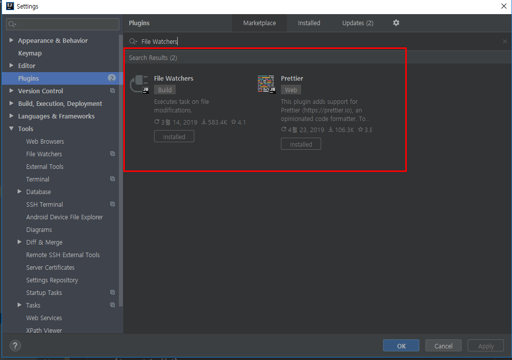
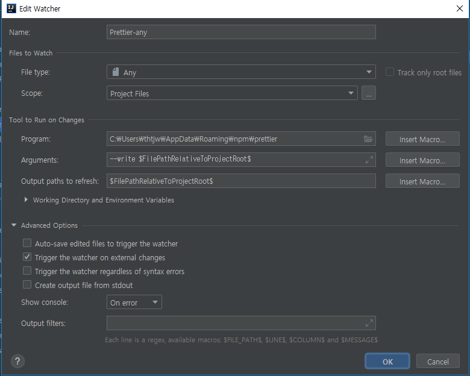
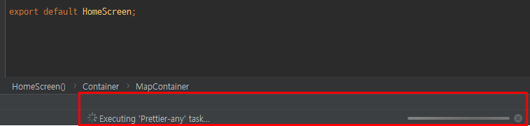
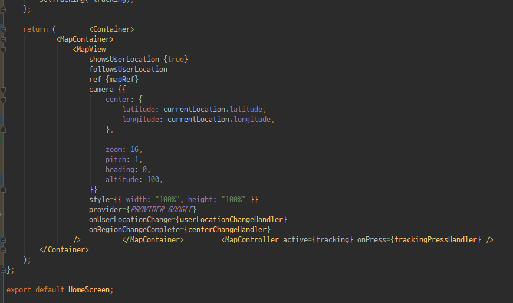
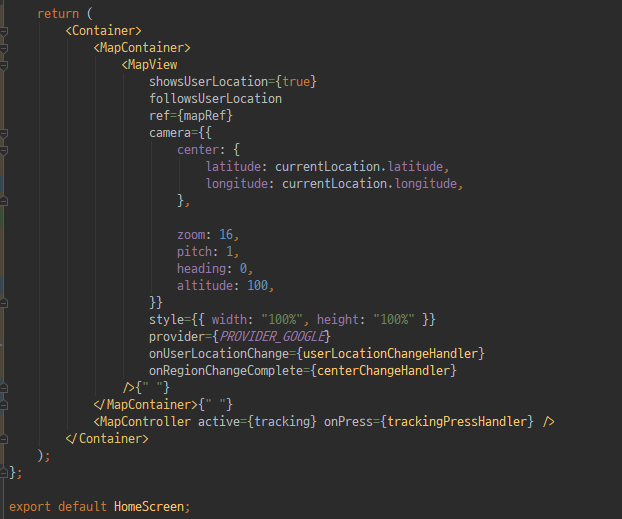

prettier 를 global 로 설치합니다.

```
$ npm install -g prettier
```

intellij plugin 의 File Watchers 와 prettier 를 설치합니다.

> _File > Settings > Plugins > Marketplace > 'prettier' and 'File Watchers' install_



intellij 를 재부팅 후에 아래 경로로 다시 이동합니다.

> _File > Settings > Tools > File Watchers_

- 더하기모양(+) 을 클릭합니다.
- Prettier 를 선택합니다.

다른건 기본값으로 놔두고 prettier 가 관여 할 파일 확장자와, program 항목만 설정할겁니다.



_File type_ 에 저 같은경우 typescript 와 webpack 을 자주 사용하기 때문에 그냥 any 로 설정하였습니다.

_Program_ 항목에서는 아까 `npm install -g prettier` 로 설치 한 경로를 입력 해줍니다.

> 아마도 window 기본값은 `C:\Users\{username}\AppData\Roaming\npm\prettier.cmd` 인 것 같습니다.

위 사진과 같은 설정 끝. 그럼 intellij 에서 파일 저장시에 포맷이 바뀌는 것을 볼수 있습니다.



이 상태에서 저장 <code>ctrl + s</code> 을 누르면...



요렇게 됩니다. 세상 깨끗



#### 추신

근데 그냥 vscode 쓸듯... 느려..
